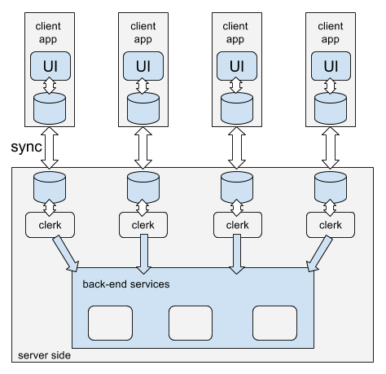
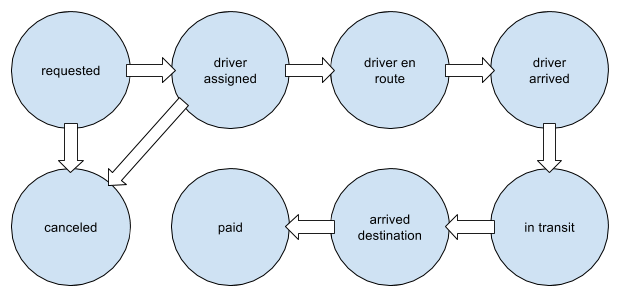

## TL;DR

HTTP RESTful APIs are the wrong level of abstraction to deliver complex transactions.

Proposed solution:

- The client app puts all the data in a document and saves it locally
- The client app continuously syncs it with a remote replica
- The client app listens to changes to that document and lets the UI reflect those changes
- A clerk working on the backend updates the document and performs state transitions on that document
- The client app also updates the document and performs state transitions

## Introduction

The transaction, checkout, reservation or payment experiences are usually the parts of the application that deliver the most value but, unfortunately, are also the ones that usually contain the most friction. We’ve all been victims of this: a checkout experience with an endless loading spinner, or a reservation page that warns you not to move a muscle while the next page is loading, one that tells you the reservation succeeded but actually only booked one of the legs, or even one that makes a double reservation (without you having to click any button twice).

Now that you have your shiny new micro-services architecture running and you’re able to deploy new features and fixes several times a day, how do you deliver complex transactions to your customers? How do you deliver payments, trip reservations or the purchase of an entire shopping cart with a good user experience?

HTTP has taken us far, but it’s probably not the best transport to deliver transactions, especially when they are performed over flaky mobile networks. A lot of error-handling logic must fall on the client application: How does the app react to request timeouts? Or gateway problems? Can it assume a transaction failed with no fear of duplication? Can the transaction survive client crashes? Can the client-side of the application solve all these existing edge cases without making it overly complex and bug-prone?

This article proposes an original architecture style that will sit in front of your micro-service stack, onto which you can attach to any existing service back-end. I will show you an implementation of this architecture pattern: a proof-of-concept application and a set of client and server open-source libraries built on top of
PouchDB and Node.js.

## Remote CRUD APIs are the wrong level of abstraction

HTTP has been around for a long time and we have taken it for granted. We use it to deliver hypertext, images, sound, videos. We use it to transfer form data from the client to the server. We also use it as the transport mechanism of remote service calls, either initiated by web applications, a mobile native app or even a simple command-line interface. We started by using complicated constructs like XML messages inside SOAP envelopes and delivered using HTTP, but we gained some sense along the ways and now we fully embrace HTTP and live and breathe by the URL path, the HTTP methods and the HTTP response status codes. A URL structure represents the resources behind the service, and the HTTP methods indicates the action: a GET request shouldn’t change the server state, a POST request is used to create a resource, a 403 response status means that you’re not allowed to access the given resource, etc. The body of knowledge surrounding HTTP and the expected behavior has permeated the many and growing numbers of client libraries, service wrappers and applications.

We now rely on HTTP-transported APIs to do almost everything digital that needs remote communication: from simple things like reading a blog post to sending a message, onto more complex operations like making a payment using online banking or reserving a flight on your favorite airline carrier. But is HTTP really suited for these more complex transactions? Being a request-response protocol, HTTP imposes serious limitations on what can be solved at the protocol level.

Take this example: John is booking a three-legged train trip that spans two train providers using a web interface. Once he inputs all the required personal and payment data and hits the “Confirm and pay” button, what happens behind the scenes?

To start with, the web application John is using performs a POST request to the http://api.awesometrainbookingplatformservice.com/trip URL, with the body of the request containing all the details necessary to book the journey: all the identifiers for the legs, his personal details and the necessary payment data. The request will eventually reach an HTTP server where it starts getting handled.

Let’s say that this server, having now received the request, has to contact a series of back-end services to process the payment and make the reservation. On the back-end, this request has a set of possible states that the end user is never aware of: each of the legs has to be reserved separately (because they use difference providers), the payment has to be authorised, the customer invoice must be created and many other possible things, all tied between themselves in complicated ways that took a long time to develop.

On a good day, this request goes through all the necessary steps with no problems: all the internal databases, cache and queueing systems are up and running, the supplier back-end services reply correctly and with little latency, the payment provider and customer bank don’t decline the payment, and a few seconds later the customer web app signals that the reservation has been successful and a few seconds later the customer gets and email with the issued tickets.

But there are a bunch of things that can go wrong in this scenario. Here are some of them:

## The request returns a 5xx error

In this case there was a server-side error, where a lot of things could have gone wrong:

- The load balancer could have lost connectivity to the application server
- The application server process could have died
- There could be a bug in the application server
- One of the back-end services misbehaved in an unexpected way

What is the current state of the transaction? Did it complete, was it aborted, is it in transit? Maybe there’s some useful information of the current state of the transaction on the response, or maybe there isn’t…

## The request times out

The response to the client request takes a lot of time to come, and eventually the client will have to declare defeat and give up. To the client, this scenario is similar to the one before (they just don’t know the current state of the transaction), but with an added bonus: the customer is even more frustrated because of the waiting time.

## There is a networking error

Here we can have two sub-scenarios: The first one is where the client never got to connect to the server, in which case it is safe to retry.

The other one is where the connection was dropped before getting a reply. Here, the client is also left not knowing what the state of the transaction is.

## The browser session disappears

When John presses that “Confirm and pay” button, he should be very careful about what he does to the browser. When switching tabs he may inadvertently close the tab with the undergoing transaction or activate a different web app that makes the whole browser crash.

What happens now? Now John doesn’t know the outcome of the transaction, and he’s left looking at his email inbox, wondering…

## The common result

I think most of us have been through this: clicking on the “Confirm and pay” button and hoping that it all goes right. Transactions are, most of the time, inherently complex, but if we don’t move this complexity away from the client code, we’re inducing mistrust, fear and frustration of using the one part of the application that generates value.

## Existing workarounds

Many customer-facing applications are aware of these problems and use some technical solutions / workarounds to address this problem. The main issue here is that this problem is not only one single problem: given the low abstraction level (given by CRUDy RESTful HTTP APIs) to the client, this problem is a set of problems, and for each one we can try to come up with a solution.

In face of an error, retry or not? What should be the client reaction when it gets an error? Should it try to post the transaction again? If the transaction actually went through, there is the risk of duplicating it.
One way of avoiding the risk of duplication is for the client to create a unique customer transaction identifier for each remote call. If this identifier is sent for every transaction, the back-end has a chance to avoid duplicating the transactions. If the client reposts the transaction and finds that the server replies with something like “duplicate client transaction id”, we can be confident that our transaction is being processed and everything is back on track again.

## Long-running transactions

In some types of transactions, the times it takes to complete is too long for the HTTP request to be left hanging and a timeout results.

If that is the case, the way to deal with long-running transactions is that the initial request only begins the transaction. The client will then be notified once the transaction reaches a final state. This may involve several techniques:

Again, creating a client-side transaction ID that can be used for polling (it also avoids duplicates if the user needs to resend the first request);

Either polling the server for the state of the transaction or
get notified by the server (using XHR long polling, server-sent events or websockets) that the transaction changed state.

## The client session disappears

If the browser tab gets closed, the browser process dies or even if the device runs out of battery, or the CPU explodes, how can the customer recover?

If the transactions are associated with a user account, losing the session mid-transaction (for instance, by closing the browser tab or powering down the computer) is a problem that can be solved through:
the backend stores each customer transaction associated to the account
the user can use the app to list all the recent transactions, discovering if the transaction exist and what is its state

Another more user-friendly technique is, before starting the transaction, to create it locally. If the session is lost mid-transaction, the application can eventually pick that up and enquire the back-end about its latest status.

## Is there a better way?

Because they deviate from the “happy” application flow, these solutions and techniques are hard to implement right on the client-side. They require the application developer to simulate all these diverse failure modes and edge cases, and hopefully create automated tests for them to make sure they keep working in the future.

In this article we present a way to develop applications where recovering from these kinds of errors requires no programming effort and is a direct consequence of the way the clients interact with the service.

## Hello offline-first

An offline-first application is an application that is built never assuming that the device that is running it is connected to the internet.

Instead, some or all possible operations can be performed locally, and later be sync’ed with the service once the device is connected to the internet.

This mode of operation is very realistic: mobile networks are flaky, intermittent and often not available. The majority of internet users are using mobile networks, and this share will keep on growing.

Developing an application using an offline-first approach also offers another advantage: by allowing a subset of the application functions to be performed without a connection to the back-end service means that these interactions will be local, which in turn means they’ll be orders of magnitude faster.

## Not all operations?

At first glance, we can say that not all operation types are suitable candidates for this scheme. For instance, how can operations like “transferring money” or “booking a train trip” be performed while we are offline? If the service is centralised, the application needs to be able to contact the service eventually, but the transaction should not be interrupted only because the service is not reachable right now.

Let me show you my idea of how I think most (if not all) operations can benefit from it, increasing development speed, availability, robustness, perceived quality and customer experience.

## Using replication

An offline-first solution for transactions requires two important pieces: one client-side data store and a corresponding server-side one. They’re both kept in sync by a sync protocol: a change in the client is asynchronously propagated to the server, and the reverse is true: a change to customer data performed on the server is replicated into the client.

The centre of this scheme is the replication protocol, and not all databases types lend themselves easily to this.

CouchDB is an open-source document-oriented database server that has been built from the ground up with two-way replication on the mind. Any group of CouchDB databases can be kept in sync with each other by activating its replication protocol.
PouchDB is a close cousin of CouchDB, but it’s written in JavaScript and can run in a JS client browser or in a server using Node.js. PouchDB is protocol-compatible with CouchDB, which means that you can replicate a CouchDB database into PouchDB and vice-versa.
CouchDB and PouchDB may not be the only databases that allow the type of replication we need, but they’re very suited to our needs, so we’re going to assume we’ll be using these. If there are other products out there (open-source or not) that have the required capabilities and run on the client, these can be used as drop-in replacements in this type of architecture.

## What about conflicts?

CouchDB and PouchDB both allow one-way replication, but for this article we’re going to use two-way replication: any change of either the client or server databases is going to get propagated into the other. This means that both databases behave like master databases, which means that conflicts can occur. How are they to be handled?

CouchDB and PouchDB can keep every change for a given document in a tree-like structure. Each version of a document can have one or more descendants. When there’s a conflict in the replication process, one of the versions gets picked as being the winner, but the database keeps all the information about the conflict around. Any one of the client or server databases can then get the unresolved conflicts and solve them by using whatever merging strategy they see fit.

## What about authentication?

The way that we’re going to use Couch or PouchDB is to have one database per client (in CouchDB-speak, one “database” corresponds to what a “table” is to relational databases). We have to make sure that each client database can only be accessed by the owner client and the clerk working on it.

On the server-side, any one of these databases can be limited to only be accessible by the owner client. I’m not going to dive too much into authentication here, but just to give you a glimpse of the architectural solution, here are the two techniques that can be used to solve this:

If using CouchDB as the server, you can use CouchDB system users. Here, one customer is one CouchDB system user, given permission to write to only that one database.

Use an ad hoc authentication mechanism (like when exposing the database through a smart proxy)

The first one works because we’re using one database per user or session.

In our solution, we’re not using HTTP — instead we’re using a web-socket sync server where the client and server negotiate an authenticated channel over an encrypted connection using a server certificate. Once the sync server has verified the credentials that were sent by the client when negotiating the channel, that channel is established, the sync server has the user identified and has it boxed into a private database.

## A persistent transaction document

Now that we have a client database sitting in both the server side and the client side and they’re being kept in sync, let’s persist our transaction.

Instead of performing a remote call to begin the transaction, let’s create one document that describes the transaction in its entirety. For instance, if you want to book a train travel, create a document that will eventually describe all the legs of the journey and the details about the passengers. Or, if you’re ordering tangible products, create a shopping basket document that will eventually contain the product codes, quantities, discount codes, delivery address and payment method details. If you want to perform a bank transaction, include the source and target accounts, the amount, and perhaps some authentication token.

The client then persists this transaction document in the local database.

## A finite state machine

This document has one special property: the current state.

In any given time and database, a given transaction document can be in one state. You need then to define a given finite state machine, containing all the possible states and the possible transitions between them.
For instance, if you’re using an app to order a taxi, the document can be in one of the following states: requested, searching driver, driver assigned, driver en route, driver arrived, in transit, arrived destination, paid, canceled and perhaps others.

Mind you that, in this type of architecture, an application can support many different transaction types without needing to share a common state machine. Each transaction type would be a different document type, handled by separate clerks.

## State transitions

Each state has a set of next states that are possible. To simplify, we’re going to assume that, in any given state, either the client or the server can perform a state change, not both.

Depending on business requirements, deviations from this rule can exist. If you require it, you must handle state change conflicts. The CouchDB and PouchDB APIs make it relatively straight-forward for you to get notified when a conflict happens and to resolve that conflict.

## Client UI

Since the document is replicated in both directions, any change of state is sent the other way. If, for instance, the server changes the taxi request document state from “requested” to “driver assigned”, that change will be propagated to the client. The client then has to listen to document changes (PouchDB allows you to do this very easily), and reflect them in the UI.

If you’re using a technology like Angular, React or Ember, the UI can react to document changes and reflect the document state easily. For instance, when the document state is “driver en route”, you can present the driver’s estimated time of arrival. Or when the document state is “in transit”, the UI can present a map of the current location, etc..

## Client synchronisation status

The only concern that the client may need to have regarding the synchronisation algorithm is the status of the synchronisation. Whether all the local changes have been sent to the server and whether the client is connected to the back-end (and thus apt to receive the latest server-side changes) may be the only two important signals the programmer may need to show up on the UI.

## A clerk working on your behalf

An important part of this system is the clerk. The clerk is an entity that is on the server side. It reacts to document changes (easily accomplished by listening to a changes feed), does what it needs to do (invoke back-end services, for instance), and then changes the transaction document state. Any server-side change to the transaction document is saved and consequently replicated into the client.

There are several advantages to this:

## Latency

In terms of network latency, the clerk is in a better position to interact with the back-end systems.

## Less client complexity

All the recovery from recovering from error conditions and weird edge cases is now going to be performed by the clerk in a controlled environment, not the client.

Also, this is a much simpler programming model for the front-end developer.

## Less responsibility on the client

The clerk’s job of making a change in a document in a database nearby is much less complex than replying to a request or pushing that change into the client. It is the job of the sync mechanism to transport the state change into the client.

## Security

In a typical public service, the customer is not allowed to directly change central records, but that’s exactly what most APIs let customers do: directly change the records they have access to (minus some validations that the developers remember to put in place).

When looking at a transaction document as a declaration of intention from the customer, the clerk is bound to make much informed, and controlled changes to any central record.

## Benefits for the customer

- Network Fault-tolerance: When using this scheme, the client can recover gracefully from network failures without any additional logic.
- Responsiveness: Also, since all changes deriving from user interaction are local, this can improve the perception of application responsiveness.
- Convenience and ease of use: users can start and progress transactions independent of whether the back-end service is reachable or not.
- Improved quality: it can be argued that, with a simpler programming model, it will be easier to ship less bugs.
- Increased satisfaction: since the transaction availability and overall experience is improved, the customer satisfaction with the service should also improve.

## Benefits for the programmer

This model could set a simpler and easier programming paradigm for building apps.
The only concern of the programmer in what regards the back-end services is with the network is the synchronisation status, everything else build down to state transition handlers on the clerk side, and, on the client side, making document state changes and propagating these changes to the UI.
Even this last concern can be avoided by using a modern web framework like React and a plugin that takes care of this — this is explained in detail further down.
