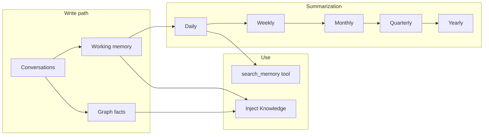

Giving agents **long-term memory** is hard: [context windows](https://en.wikipedia.org/wiki/Context_window) are limited, storing every raw message is expensive, and retrieval has to be both fast and relevant. We solved this with a **time-stratified** design: organize memory by temporal grain, summarize progressively, and pair it with a **graph-based knowledge base** for structured facts. Here’s how it works under the hood.

**In short:** six time grains (working → yearly), progressive summarization, plus a graph for *who/what* facts.

> **What is Helpmaton?** [Helpmaton](https://helpmaton.com) is a workspace-based platform for creating, configuring, and deploying AI agents at scale (see [Building Helpmaton: An Infrastructure Layer for AI Agents](/building-helpmaton-an-infrastructure-layer-for-ai-agents) for the broader story). Teams and developers use it to build customer support bots, internal knowledge assistants, scheduled automations, and API-driven workflows—without standing up their own infra for webhooks, knowledge bases, or memory. I built it because I wanted a place where deploying an agent with real context (documents, past conversations, structured facts) was straightforward: you create a workspace, add agents and docs, and get webhook endpoints and tools like `search_memory` out of the box. The memory system described below is one of the things that makes those agents useful over time.


---

## The problem

Agents need to remember **facts**, **people**, and **events** across many conversations. Raw logs don’t scale and don’t support [semantic search](https://en.wikipedia.org/wiki/Semantic_search) (I've written before about [building semantic search for AI agents](/building-semantic-search-for-ai-customer-service-agents)). We needed a design that keeps recent detail queryable while compressing the past and staying cost-bounded.

> **Core idea:** Organize memory by **temporal grain** (working → daily → weekly → monthly → quarterly → yearly), summarize progressively, and keep a separate **graph knowledge base** of (subject, predicate, object) facts. In this post you’ll see the architecture, data flow, consistency and scaling choices, how agents use memory (search + optional injection), and how the graph complements vector memory.

---

## Why stratification?

**Recent** interactions need fine-grained, searchable facts; **older** ones can live as summaries. We use **six grains**:

| Grain      | Time format       | Role                          |
| ---------- | ----------------- | ----------------------------- |
| **working** | (none)            | Raw conversation facts        |
| **daily**   | `YYYY-MM-DD`      | Daily summaries of working    |
| **weekly**  | `YYYY-W{week}`    | Weekly summaries of daily     |
| **monthly** | `YYYY-MM`         | Monthly summaries of weekly   |
| **quarterly** | `YYYY-Q{quarter}` | Quarterly summaries of monthly |
| **yearly**  | `YYYY`            | Yearly summaries of quarterly |

**Benefits:** Fast [semantic search](https://en.wikipedia.org/wiki/Semantic_search) on recent data, **bounded storage** via summarization, and information preserved across time scales.

---

## Architecture at a glance

- **Storage:** One vector DB ([LanceDB](https://lancedb.com/)) per agent per grain. Working memory is one DB per agent; other grains are one DB per time period, e.g. `vectordb/{agentId}/daily/2024-01-15/` in [Amazon S3](https://docs.aws.amazon.com/s3/).
- **Data flow:** Conversations → working memory (facts + [embeddings](https://en.wikipedia.org/wiki/Word_embedding)) → daily summarization → weekly → … → yearly.
- **Scheduled jobs:** Daily / weekly / monthly / quarterly / yearly summarization [AWS Lambda](https://docs.aws.amazon.com/lambda/) functions, plus a daily retention-cleanup job.

**Two pillars of agent knowledge:**

1. **Stratified vector memory** (above): temporal grains, progressive summarization, [semantic search](https://en.wikipedia.org/wiki/Semantic_search).
2. **Graph knowledge base:** Structured (subject, predicate, object) facts per agent, used for [entity-based](https://en.wikipedia.org/wiki/Named-entity_recognition) lookup at inject time (see below).



---

## Knowledge base: graph database

The graph stores **structured facts** ([subject–predicate–object](https://en.wikipedia.org/wiki/Semantic_triple) triples) per agent and answers questions like *“What do we know about Alice?”* via **entity-based lookup**. It complements **vector memory**, which is best for *“what was said when”* and semantic similarity.

- **Stack:** [DuckDB](https://duckdb.org/) in-process with the [DuckPGQ](https://duckdb.org/docs/extensions/duckpgq.html) extension for [property-graph](https://en.wikipedia.org/wiki/Graph_database) queries; data persisted as [Apache Parquet](https://parquet.apache.org/) in S3.

- **Storage:** One `facts` table per agent at `s3://bucket/graphs/{workspaceId}/{agentId}/facts.parquet`. Schema: `id`, `source_id`, `target_id`, `label`, `properties` (e.g. confidence, conversationId, updatedAt).

- **How facts get in:** When conversations are created or updated, an LLM **memory extraction** step extracts facts and emits memory operations (INSERT / UPDATE / DELETE). [`applyMemoryOperationsToGraph()`](https://github.com/djinilabs/helpmaton/blob/main/apps/backend/src/utils/memory/memoryExtraction.ts#L407) in [memoryExtraction.ts](https://github.com/djinilabs/helpmaton/blob/main/apps/backend/src/utils/memory/memoryExtraction.ts#L1) applies these to the graph via `graphDb` (insertFacts, updateFacts, deleteFacts, save). The same pipeline can also write working-memory vectors.

- **How it's used:** At conversation start, **Inject Knowledge** (if enabled) extracts entities from the user prompt using an optional entity-extractor model. [`searchGraphByEntities()`](https://github.com/djinilabs/helpmaton/blob/main/apps/backend/src/utils/knowledgeInjection/graphSearch.ts#L19) loads the graph, queries facts where `source_id` or `target_id` is in the entity list, and returns (subject, predicate, object) snippets. Those are merged with working-memory snippets and document snippets and can be re-ranked before injection.

- **API:** `createGraphDb(workspaceId, agentId)` returns `insertFacts`, `updateFacts`, `deleteFacts`, `queryGraph(sql)`, `save()`, `close()`. Graph search lives in [graphSearch.ts](https://github.com/djinilabs/helpmaton/blob/main/apps/backend/src/utils/knowledgeInjection/graphSearch.ts#L1). See the [graph database doc](https://github.com/djinilabs/helpmaton/blob/main/docs/graph-database.md#L1) and [graphDb.ts](https://github.com/djinilabs/helpmaton/blob/main/apps/backend/src/utils/duckdb/graphDb.ts#L341) for details.

---

## Writing memory: consistency and scale

- **When:** On conversation create/update we extract facts, embed them via [OpenRouter](https://openrouter.ai/) using the [`thenlper/gte-base`](https://openrouter.ai/models/thenlper/gte-base) embedding model, and write to working memory.
- **How:** Writes go through [Amazon SQS FIFO](https://docs.aws.amazon.com/AWSSimpleQueueService/latest/SQSDeveloperGuide/FIFO-queues.html) ([FIFO](https://en.wikipedia.org/wiki/FIFO_(computing_and_electronics)) = first-in, first-out) queues with message group `{agentId}:{grain}` so only one writer per DB runs at a time—no races on the same LanceDB instance.
- **Flow:** API → extract facts → embed → enqueue → SQS handler → LanceDB. For more on how we use message groups, see [FIFO queue message grouping](https://docs.aws.amazon.com/AWSSimpleQueueService/latest/SQSDeveloperGuide/using-messagegroupid-property.html). That keeps Lambda and DB usage **decoupled** and **serialized**.

---

## Summarization pipeline

We run **[LLM](https://en.wikipedia.org/wiki/Large_language_model) summarization** from finer grain to coarser (e.g. working → daily, daily → weekly). Prompts are **grain-specific**: daily focuses on events, people, and facts; weekly on narrative; monthly and above on themes and milestones.

- **Schedule:** Cron-like [Lambda](https://docs.aws.amazon.com/lambda/) invocations—daily, 7d, 30d, 90d, 365d for each grain. The [scheduled summarization tasks](https://github.com/djinilabs/helpmaton/blob/main/apps/backend/src/scheduled/) and their rates are defined in [app.arc](https://github.com/djinilabs/helpmaton/blob/main/apps/backend/app.arc#L324-L333) ([Arc](https://arc.codes/) / Architect).
- **Process:** Query the source grain by time window → concatenate content → call LLM → embed summary → write to the next grain. Same pattern at every level; only the time window and prompt change.

---

## Search and how agents use memory

Agents get a **`search_memory`** [tool](https://github.com/djinilabs/helpmaton/blob/main/apps/backend/src/http/utils/memorySearchTool.ts#L14) with grain, `minimumDaysAgo` / `maximumDaysAgo`, `maxResults`, and optional `queryText` for [semantic search](https://en.wikipedia.org/wiki/Semantic_search). **Behavior:** vector search within the chosen grain with optional date filter; results can be date-prefixed for the model.

**Inject Knowledge** (optional) combines two memory sources at conversation start:

1. **Working-memory vector search** — semantic similarity to the prompt.
2. **Graph facts** — entity-based: extract entities from the prompt, then fetch facts where subject or object matches.

Results are merged with document snippets and optionally **re-ranked** (e.g. via a [cross-encoder](https://www.sbert.net/examples/applications/cross-encoder/README.html) or similar) before the first user message.

**Example:**

```typescript
const results = await searchMemory({
  agentId: "agent-123",
  workspaceId: "workspace-456",
  grain: "daily",
  minimumDaysAgo: 0,
  maximumDaysAgo: 30,
  maxResults: 10,
  queryText: "React project discussion",
});
```

---

## Retention and cost control

Unlimited growth would be **expensive** and **noisy**. We enforce **per-plan retention** per grain and run a daily cleanup job.

| Plan      | Working   | Daily    | Weekly   | Monthly   | Quarterly   | Yearly  |
| --------- | --------- | -------- | -------- | --------- | ----------- | ------- |
| **Free**  | 48 hours  | 30 days  | 6 weeks  | 6 months  | 4 quarters  | 2 years |
| **Starter** | 120 hours | 60 days  | 12 weeks | 12 months | 8 quarters  | 4 years |
| **Pro**   | 240 hours | 120 days | 24 weeks | 24 months | 16 quarters | 8 years |

Older data is pruned per grain so storage stays predictable.

- **Cleanup:** One daily job; for each workspace/agent/grain we compute the cutoff from the plan, delete older records, and process from the most granular grain (working) upward.

---

## Implementation details engineers care about

- **LanceDB:** [Vector database](https://en.wikipedia.org/wiki/Vector_database) per grain (and per time period for non-working); S3 path layout as above. See [LanceDB documentation](https://lancedb.github.io/lancedb/).
- **Graph (knowledge base):** DuckDB + DuckPGQ; single `facts` edge table per agent; memory extraction writes via [memoryExtraction.ts](https://github.com/djinilabs/helpmaton/blob/main/apps/backend/src/utils/memory/memoryExtraction.ts#L407); entity-based retrieval in [graphSearch.ts](https://github.com/djinilabs/helpmaton/blob/main/apps/backend/src/utils/knowledgeInjection/graphSearch.ts#L19). See the [graph database doc](https://github.com/djinilabs/helpmaton/blob/main/docs/graph-database.md#L1).
- **Embeddings:** One model for all facts and summaries (OpenRouter; [text embeddings](https://en.wikipedia.org/wiki/Word_embedding) for semantic similarity); API key/credits and BYOK are supported where relevant.
- **Testing:** An [integration test](https://github.com/djinilabs/helpmaton/blob/main/apps/backend/src/utils/memory/__tests__/memorySystem.integration.test.ts#L1) runs the full pipeline (conversations → working → … → yearly), retention cleanup, and search; LLM, embeddings, and SQS are mocked.
- **File references:** Vector memory — [writeMemory.ts](https://github.com/djinilabs/helpmaton/blob/main/apps/backend/src/utils/memory/writeMemory.ts#L85), [summarizeMemory.ts](https://github.com/djinilabs/helpmaton/blob/main/apps/backend/src/utils/memory/summarizeMemory.ts#L135), [searchMemory.ts](https://github.com/djinilabs/helpmaton/blob/main/apps/backend/src/utils/memory/searchMemory.ts#L45), [retentionPolicies.ts](https://github.com/djinilabs/helpmaton/blob/main/apps/backend/src/utils/memory/retentionPolicies.ts#L54). Graph — [graphDb.ts](https://github.com/djinilabs/helpmaton/blob/main/apps/backend/src/utils/duckdb/graphDb.ts#L341), [graphSearch.ts](https://github.com/djinilabs/helpmaton/blob/main/apps/backend/src/utils/knowledgeInjection/graphSearch.ts#L19), [memoryExtraction.ts](https://github.com/djinilabs/helpmaton/blob/main/apps/backend/src/utils/memory/memoryExtraction.ts#L407) (applyMemoryOperationsToGraph).

---

## Performance and operational notes

- **Serialization:** [SQS message groups](https://docs.aws.amazon.com/AWSSimpleQueueService/latest/SQSDeveloperGuide/using-messagegroupid-property.html) prevent concurrent writes to the same DB.
- **Batching:** Summarization processes in batches where applicable.
- **Cleanup:** Daily retention keeps storage predictable.
- **Vector search:** LanceDB per grain ([approximate nearest neighbor](https://en.wikipedia.org/wiki/Nearest_neighbor_search#Approximate_nearest_neighbor) search over embeddings); we don’t dive into LanceDB internals here—just *“vector index per grain.”*

---

## Future directions

- **Configurable** summarization prompts per agent.
- **Custom retention** per workspace.
- **Richer search** (by person, event type) and memory analytics.
- **Cross-agent memory** in team workspaces.

---

## Wrapping up

Agents get long-term memory from **two subsystems**:

1. **Stratified vector memory** — grains, progressive summarization, [FIFO](https://en.wikipedia.org/wiki/FIFO_(computing_and_electronics)) writes, and retention give queryable, cost-bounded semantic memory.
2. **Graph knowledge base** — (subject, predicate, object) facts populated by memory extraction and retrieved by entity at inject time.

Together they support both *“what was said when”* and *“what we know about X.”*

> **Go deeper:** See the [agent memory system doc](https://github.com/djinilabs/helpmaton/blob/main/docs/agent-memory-system.md#L1), [graph database doc](https://github.com/djinilabs/helpmaton/blob/main/docs/graph-database.md#L1), [vector database doc](https://github.com/djinilabs/helpmaton/blob/main/docs/vector-database.md#L1), and [agent configuration doc](https://github.com/djinilabs/helpmaton/blob/main/docs/agent-configuration.md#L1) (Inject Knowledge). You can also dig into the [Helpmaton repo on GitHub](https://github.com/djinilabs/helpmaton) and the file paths above.
