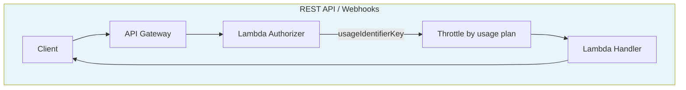
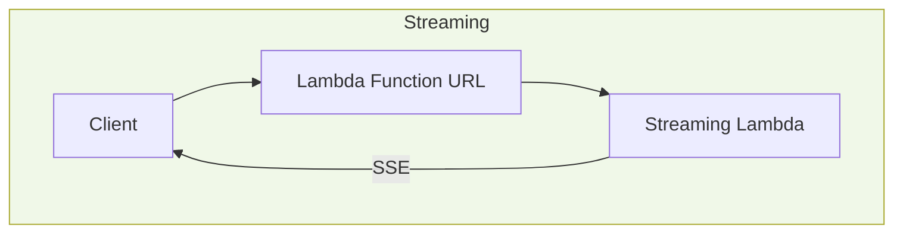
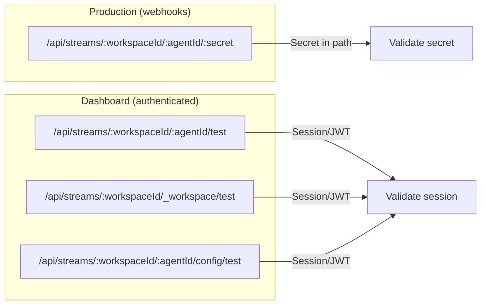
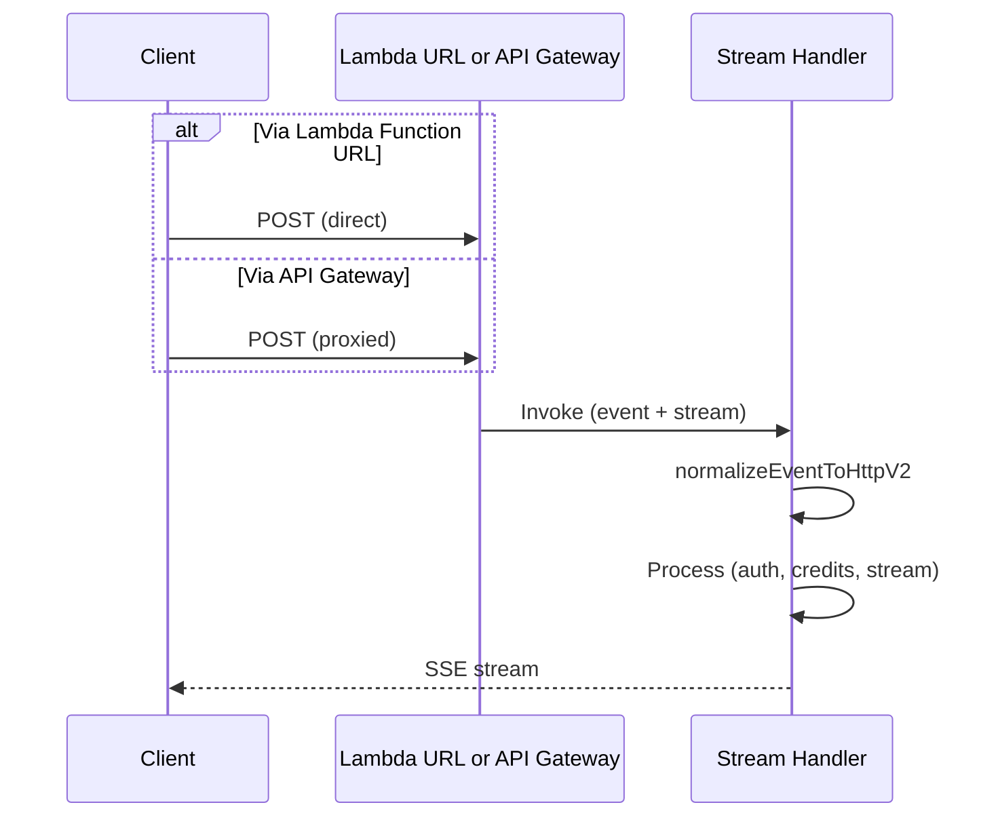
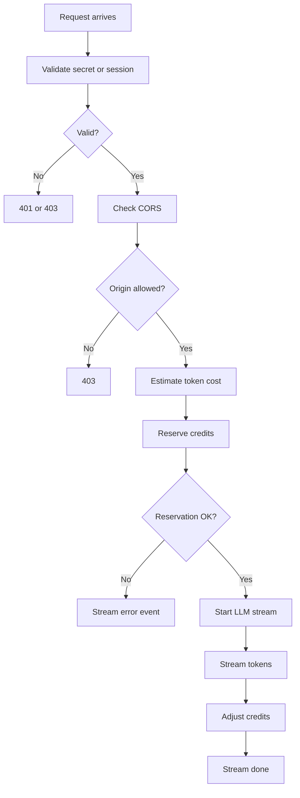
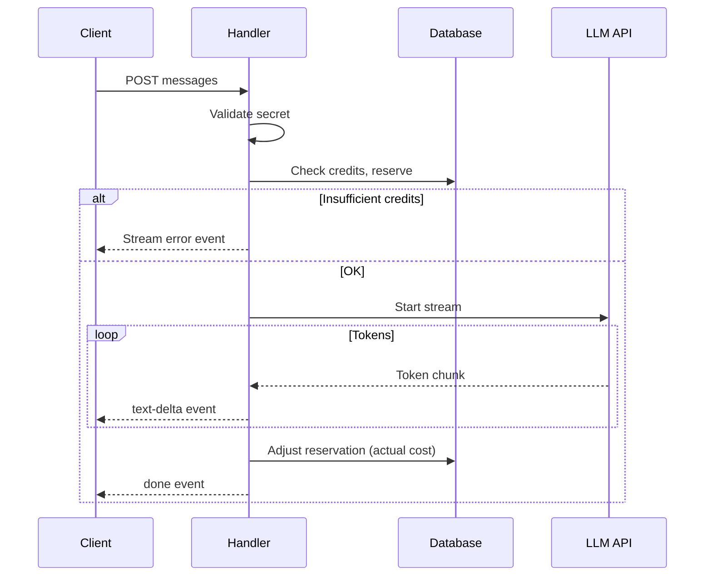

In [Building Real-Time AI Streaming Services with AWS Lambda and Architect](https://metaduck.com/building-real-time-ai-streaming-services/), I walked through how to build streaming AI services on Lambda using Function URLs, Architect, and the Vercel AI SDK. That article ended with an important caveat: **throttling streaming requests** remained an unsolved, business-dependent challenge. This post is the follow-up: how we implemented these patterns in production at [Helpmaton](https://helpmaton.com)—an AI agent platform—and addressed the throttling gap for our API layer while evolving the streaming architecture for a multi-tenant SaaS.

> **TL;DR:** We kept the same foundation (Lambda Function URLs, AI SDK, Architect) and added production-ready patterns: multi-path streaming with secret-in-path auth, a credit system for cost protection, and subscription-based throttling for our REST API. Streaming bypasses API Gateway, so tiered throttling applies to webhooks and REST—stream endpoints use credits and validation instead.

If you're not familiar with AWS: **[Lambda](https://docs.aws.amazon.com/lambda/)** is AWS's serverless compute—you run code in response to events without managing servers. **[API Gateway](https://docs.aws.amazon.com/apigateway/)** is AWS's managed service that receives HTTP requests and routes them to your backend. **[Lambda Function URLs](https://docs.aws.amazon.com/lambda/latest/dg/lambda-urls.html)** let you invoke a Lambda directly via HTTP, skipping API Gateway. **[Architect](https://arc.codes)** is a framework that defines your infrastructure as code and deploys it to AWS.

---

## Where We Left Off

The original article covered the essentials:

| Component | Purpose |
|-----------|---------|
| **Lambda Function URLs** | Direct HTTP access with [`InvokeMode: RESPONSE_STREAM`](https://docs.aws.amazon.com/lambda/latest/dg/configuration-response-streaming.html) for true streaming |
| **Custom Architect plugin** | Local development and deployment for streaming Lambdas |
| **[Vercel AI SDK](https://sdk.vercel.ai/docs)** | `streamText`, `pipeDataStreamToResponse` on the backend; `useChat` on the frontend |
| **Authentication before streaming** | Validate identity before any expensive AI operations |

The open question was throttling. Streaming requests maintain long-lived connections; they consume resources throughout their duration, not just at the start. Standard rate limiting (requests per second) doesn't naturally fit. The original article explored several approaches—pre-stream checks, mid-stream monitoring, usage-based throttling—but concluded that the ideal strategy is highly business-dependent.

At Helpmaton, we needed to ship. We built on the same architecture, adapted it for our product model (workspaces, agents, subscriptions), and solved throttling for the **API layer**—the part that goes through API Gateway—using the pattern described in [Subscription-Based API Throttling Without Client API Keys](https://metaduck.com/subscription-based-api-throttling-without-client-api-keys/). Streaming takes a different path, and we protect it differently. Here's how it all fits together.

---

## The Two-Track Architecture

Helpmaton has two distinct request paths. Understanding this split is crucial.

> **Key idea:** REST and webhooks go through API Gateway (with throttling). Streaming goes directly to Lambda (no Gateway, no throttling—we use credits instead).

**REST API and webhooks** (HTTP endpoints that external apps call) go through API Gateway. The client hits `https://api.helpmaton.com/...`; API Gateway runs an **authorizer** (a Lambda that validates the request before it reaches the main handler), applies throttling, and then forwards to the handler. We get tiered rate limits at the edge—100 req/s for Free, 2000 req/s for Pro—without the client ever sending a throttling API key. "At the edge" means before the request reaches our Lambda handlers, so we don't run code or pay for requests we reject. I wrote about that in [Subscription-Based API Throttling Without Client API Keys](https://metaduck.com/subscription-based-api-throttling-without-client-api-keys/).

**Streaming** bypasses API Gateway entirely. The client hits a Lambda Function URL directly—a URL that invokes Lambda without going through API Gateway. No API Gateway, no authorizer, no usage-plan throttling. We get lower latency and native streaming—but we need other mechanisms to protect against abuse. Credits, secret validation, and CORS (Cross-Origin Resource Sharing—checks that the request comes from an allowed origin) fill that gap.

Here's the architecture at a glance:





| Path | Throttling | Auth | Latency |
|------|------------|------|---------|
| **REST / Webhooks** | [API Gateway usage plans](https://metaduck.com/subscription-based-api-throttling-without-client-api-keys/) (per subscription; rate limits per tier) | Bearer token (e.g. [JWT](https://jwt.io/)) or path secret | Higher (Gateway in path) |
| **Streaming** | Credits, secret validation—no edge throttle | Secret in path or session | Lower (direct to Lambda) |

---

## Streaming Implementation: Same Foundation, Different Shape

### Lambda URLs and the `@lambda-urls` Pragma

We define streaming routes in Architect with `@lambda-urls`:

```
@lambda-urls
any /api/streams/*
```

The plugin creates Lambda Function URL resources (AWS's way of giving a Lambda a direct HTTP endpoint). With `InvokeMode: RESPONSE_STREAM`, the Lambda can stream responses back to the client instead of buffering the whole response. Each route gets a direct URL like `https://{id}.lambda-url.eu-west-2.on.aws`. No API Gateway in front—the client connects straight to Lambda.

**Why bypass API Gateway for streaming?** Two reasons. First, **latency**: every hop adds delay; for real-time token-by-token streaming, we want the shortest path. Second, **streaming behavior**: API Gateway can buffer responses; [Lambda Function URLs support response streaming](https://docs.aws.amazon.com/lambda/latest/dg/configuration-response-streaming.html) natively. The trade-off is that we lose API Gateway's built-in throttling—we accept that and handle protection in the Lambda itself.

### Stream Path Variants

We don't have a single chat endpoint. We have several, each with different auth and purpose:



| Path | Auth | Use case |
|------|------|----------|
| `POST /api/streams/:workspaceId/:agentId/:secret` | Secret in path | Production: customer apps, webhooks, integrations. No cookies or headers—the secret is in the URL. |
| `POST /api/streams/:workspaceId/:agentId/test` | Session or Bearer | Test a specific agent in the Helpmaton UI. |
| `POST /api/streams/:workspaceId/_workspace/test` | Session or Bearer | Workspace assistant—a virtual agent for the whole workspace. |
| `POST /api/streams/:workspaceId/:agentId/config/test` | Session or Bearer | Meta-agent: "Configure with AI" chat for configuring that agent. |

**Secret-in-path auth** is deliberate for production. Integrators embedding our agents in their apps don't need to deal with CORS preflight for credentials. They just POST to a URL that includes the secret. We validate it against our `agent-stream-servers` table—lookup by secret, verify workspace and agent match. Invalid secret → 401 before any LLM call.

> **Security note:** The secret appears in the URL, so it can end up in server logs, browser history, or referrer headers. We recommend using it server-side only—e.g. from a backend that proxies to our stream endpoint—rather than in client-side JavaScript.

### Dual Handler Support

The same streaming handler can be invoked in two ways: **directly via Lambda Function URL** (true streaming) or **via API Gateway** (e.g. when the dashboard proxies through the main API). The event shapes differ—Lambda URL events and API Gateway events have different structures—so we normalize to a common HTTP v2 format before processing. The rest of the logic doesn't care which path invoked it.



---

## Authentication and Credits: Protecting the Stream

### Authenticate Before Streaming

Same principle as the original article: **never start expensive operations until identity is validated**.

> **Rule of thumb:** Validate first, stream second. Auth failures should be cheap and fast.

For secret-based paths, we extract `workspaceId`, `agentId`, and `secret` from the URL. We query our database (the `agent-stream-servers` table) for that secret; if it exists and matches the workspace/agent, we proceed. If not, we return 401 immediately. No LLM (Large Language Model) call, no credit check—just a fast fail.

For session-based paths (test, workspace assistant, config), we validate the Bearer token or session cookie. Invalid or expired → 403. Again, no LLM work until we know who's calling.

### Credit System

AI API calls cost money. We need to prevent abuse and enforce usage limits. Throttling (requests per second) doesn't fit streaming well—a single stream can run for minutes. So we use a **credit system**.

The flow looks like this:



Before we start streaming:

1. **Estimate** token cost for the request (input + expected output).
2. **Check** workspace credit balance and spending limits.
3. **Reserve** credits atomically. If reservation fails (insufficient credits, limit exceeded), we don't start the stream.

During the stream:

4. **Track** actual token usage from the LLM response.
5. **Adjust** the reservation: if we over-reserved, we refund; if we under-reserved, we charge the difference.

If credits run out mid-stream, we can stream an error event and close gracefully. The client gets a `type: "error"` SSE event with details—no abrupt HTTP 4xx.



---

## Throttling: What Applies Where

### REST API: Solved at the Edge

For routes that go through API Gateway—webhooks, REST endpoints, dashboard API calls—we use an [authorizer](https://docs.aws.amazon.com/apigateway/latest/developerguide/apigateway-use-lambda-authorizer.html) that maps each request (path or Bearer token) to a subscription, get-or-creates an API key for that subscription, and returns it as `usageIdentifierKey`. API Gateway treats that as the "throttling key" and applies the subscription's **usage plan** (rate limits per tier) before the request reaches our Lambda. The client never sees or sends the throttling key. Full details: [Subscription-Based API Throttling Without Client API Keys](https://metaduck.com/subscription-based-api-throttling-without-client-api-keys/).

Usage plans (API Gateway's way of defining rate limits per tier):

| Tier | Rate limit | Burst limit |
|------|------------|-------------|
| Free | 100 req/s | 200 |
| Starter | 500 req/s | 1000 |
| Pro | 2000 req/s | 4000 |

*Rate limit* = max requests per second. *Burst limit* = max concurrent requests (allows short spikes above the rate).

When a client exceeds their tier, API Gateway returns **429 Too Many Requests** before the request reaches our Lambda. No authorizer or handler runs for that request—with Lambda's pay-per-invocation model, we don't pay for requests we reject.

### Streaming: Credits and Validation, No Edge Throttle

Streaming requests hit the Lambda Function URL directly. They never pass through API Gateway, so the authorizer and usage plans don't apply.

What protects streaming?

- **Secret validation**: Invalid secret → 401. No stream starts.
- **Credit reservation**: Insufficient credits → we stream an error and don't call the LLM.
- **CORS**: We validate the request origin (which domain the request came from); misconfigured or unauthorized origins get 403.
- **Request timeout**: Long-running streams are bounded by a configurable timeout.

We don't have per-second rate limits on streaming. A single workspace could, in theory, open many concurrent streams. In practice, credits act as a natural throttle—each stream consumes credits, and when the balance is depleted, new streams fail at the reservation step. For most use cases, that's sufficient. For future work, we could add concurrent-stream limits or token-per-minute caps; that would require in-Lambda logic, not API Gateway.

---

## Tool Execution and Agent Model

Like the original article, we use the AI SDK's tool support. Some tools run automatically on the server (e.g. `search_documents`, `get_tables`); others require user confirmation (e.g. saving data). The SDK handles the streaming protocol for tool calls and results.

Helpmaton-specific additions:

- **Workspace agent** (`agentId === "_workspace"`): A virtual agent with no database record. It has access to workspace-level tools—documents, configuration, and so on.
- **Meta-agent**: When configuring an agent with AI, we reuse that agent in "configuration mode." The path `/api/streams/:workspaceId/:agentId/config/test` invokes it with a different tool set (e.g. `configure_agent`).
- **Tool validation**: All tool arguments are validated with [Zod](https://zod.dev/) schemas before execution. We avoid malformed or unexpected inputs.

---

## Protocol and Frontend Integration

We use **Server-Sent Events (SSE)**—a [web standard](https://developer.mozilla.org/en-US/docs/Web/API/Server-sent_events) for streaming data from server to client over HTTP—in a format compatible with the [AI SDK](https://sdk.vercel.ai/docs). Each event is a JSON object, prefixed with `data: ` and terminated with `\n\n`:

```
data: {"type":"text-delta","textDelta":"Hello"}\n\n
data: {"type":"text-delta","textDelta":" world"}\n\n
data: {"type":"tool-call","toolCallId":"call_1","toolName":"search_documents","args":{"query":"weather"}}\n\n
data: {"type":"tool-result","toolCallId":"call_1","result":"Found 3 documents..."}\n\n
data: {"type":"done"}\n\n
```

| Event type | Purpose |
|------------|---------|
| `text-delta` | Incremental text chunk |
| `tool-call` | Agent invoked a tool |
| `tool-result` | Result of tool execution |
| `error` | Error (e.g. insufficient credits, auth failure) |
| `done` | Stream complete |

On the frontend, we use [`useChat`](https://ai-sdk.dev/docs/reference/ai-sdk-ui/use-chat) from `@ai-sdk/react`. The API URL points to the stream endpoint. For secret-based paths, no auth headers—the secret is in the URL. For session-based paths, we pass `Authorization: Bearer` or rely on cookies.

The client gets the stream URL from `GET /api/stream-url`, which returns the Lambda Function URL. The client then constructs the full path (e.g. `/api/streams/ws_123/agent_456/secret_789`) and POSTs to it.

---

## Local Development and Sandbox

The original article described a custom HTTP server that mimics Lambda Function URL behavior in local development. We do the same. The `lambda-urls` plugin, when running in **sandbox mode** (Architect's local dev environment—no real AWS, everything runs on your machine):

1. Starts an HTTP server on a configurable port.
2. Listens for requests matching the stream paths.
3. Constructs a fake Lambda event from the HTTP request (body, headers, path, query).
4. Invokes the streaming handler with a `ResponseStream`.
5. Bridges the handler's writes to the HTTP response.

We use port prefixes and `VITEST_WORKER_ID` so multiple test workers can run in parallel without port conflicts.

> **Local dev tip:** In sandbox mode, there's no real API Gateway. The authorizer detects this and returns Allow without calling AWS—no `usageIdentifierKey`, no throttling. You can develop and test without AWS credentials.

---

## Infrastructure as Code

We use several [Architect](https://arc.codes) plugins:

| Plugin | Purpose |
|--------|---------|
| `lambda-urls` | Create Lambda Function URLs for streaming (and scrape) |
| `api-throttling` | [Usage plans, authorizer](https://metaduck.com/subscription-based-api-throttling-without-client-api-keys/), method attachment |
| `container-images` | Custom Lambda container for LLM routes (LanceDB, embeddings) |
| `http-to-rest` | REST API routes |
| `custom-domain` | Custom domain for API |

Streaming routes run in a custom container (`llm-shared-stream`) that includes [LanceDB](https://lancedb.com/) for embeddings and graph operations. Lambda can run your code in a [container image](https://docs.aws.amazon.com/lambda/latest/dg/images-create.html) (like [Docker](https://www.docker.com/)) instead of a zip package—useful when you need extra dependencies. The container image is built in CI; the plugin references it in the `@container-images` pragma.

Usage plans are created by the `api-throttling` plugin with stack-unique names (e.g. `HelpmatonStagingPR25-free`). Each PR deployment gets its own **stack** (AWS's term for a deployable unit of infrastructure—a set of resources created together), so usage plans and authorizer are isolated per PR.

---

## Lessons Learned

### What Works

- **Lambda Function URLs for streaming**: Low latency, native streaming. The direct connection pays off for real-time UX. ✓
- **Secret-in-path auth for webhooks**: Simple for integrators. No CORS preflight for credentials; they just use the URL. We validate on every request. ✓
- **Path-based routing**: Workspace and agent from the path; subscription from the workspace. Clean separation of concerns. ✓
- **Credit system**: Pre-stream reserve + adjust during stream. Protects against abuse and ensures we don't over-spend. ✓

### Challenges

- **Streaming vs. throttling**: API Gateway throttling doesn't apply to Lambda URLs. We rely on credits and validation. For stricter guarantees, we'd need in-Lambda throttling (e.g. concurrent streams per workspace).
- **Dual handler**: Supporting both Lambda URL and API Gateway adds complexity. Event normalization helps, but we have to test both paths.
- **Container size**: LanceDB and LLM dependencies increase cold start (the delay when Lambda spins up a new instance to run your code). We use warm pools in development; in production, traffic patterns keep containers warm.

### Future Work

- **Stream-specific throttling**: Concurrent stream limits per workspace, or token-per-minute caps.
- **Mid-stream monitoring**: Detect abuse patterns during long streams (e.g. repeated tool calls, excessive token usage).
- **Graceful degradation**: Instead of hard cutoff when limits are hit, reduce quality or speed (e.g. switch to a cheaper model, slow down throughput).

> **Related:** Our [Deploying Pull Requests](https://metaduck.com/deploying-pull-requests-a-complete-aws-stack-for-every-pr/) article covers how each PR gets its own isolated AWS stack—including unique usage plans and stream URLs.

---

## Summary

We built on the [original streaming architecture](https://metaduck.com/building-real-time-ai-streaming-services/) with production-ready patterns for Helpmaton:

| Aspect | Our approach |
|--------|--------------|
| **Streaming** | Lambda Function URLs, multiple path variants (secret-based + session-based), SSE protocol |
| **Auth** | Secret in path for production; session/JWT for dashboard |
| **Cost protection** | Credit system: reserve before stream, adjust during stream |
| **Throttling** | REST API: [Lambda authorizer + usage plans](https://metaduck.com/subscription-based-api-throttling-without-client-api-keys/) at the edge. Streaming: credits and validation—no edge throttle |
| **Local dev** | Sandbox server mimics Lambda Function URL for streaming; authorizer short-circuits (no AWS) for REST routes |

The throttling question from the original article is partially solved: we have [tiered rate limits for our REST API and webhooks](https://metaduck.com/subscription-based-api-throttling-without-client-api-keys/), enforced at the gateway, without forcing clients to send a throttling key. Streaming uses a different path and different protection—credits and validation—and that's been sufficient for our use case. For high-traffic or high-abuse scenarios, we'd add stream-specific limits in the Lambda.

For more on our stack, see [Building Real-Time AI Streaming Services with AWS Lambda and Architect](https://metaduck.com/building-real-time-ai-streaming-services/), [Subscription-Based API Throttling Without Client API Keys](https://metaduck.com/subscription-based-api-throttling-without-client-api-keys/), and [Deploying Pull Requests: A Complete AWS Stack for Every PR](https://metaduck.com/deploying-pull-requests-a-complete-aws-stack-for-every-pr-).

---

**Ready to build AI agents with streaming, credits, and tiered throttling out of the box?** [Helpmaton](https://helpmaton.com) is [open-source](https://github.com/djinilabs/helpmaton), runs on AWS, and handles real-time streaming, subscription-based rate limiting, and credit management so you can focus on your agents—not the infrastructure.
