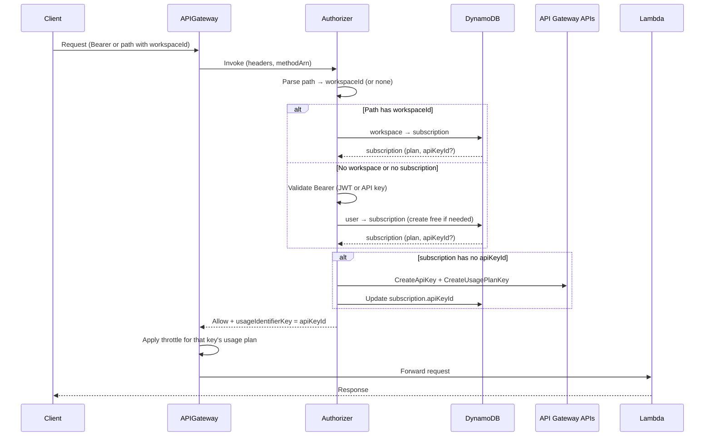
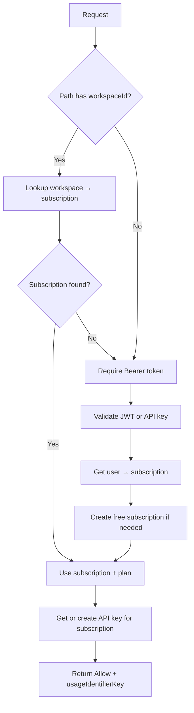
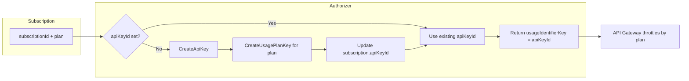

[Helpmaton](https://helpmaton.com) is **open-source** and **cloud-native**: it runs on AWS—Lambda, API Gateway, DynamoDB, S3, CloudFront, and SQS—with infrastructure defined as code via [Architect](https://arc.codes). We run a multi-tenant API where workspaces create AI agents, expose webhooks, and call our API from their own apps. We need to throttle requests by **subscription tier** (Free, Starter, Pro)—but we didn’t want to force every client to send a separate “throttling API key.” They already send a Bearer token, a webhook secret in the path, or a session cookie. This post is about how we get tiered rate limits at the API Gateway edge while keeping the client contract simple: **throttling by subscription, without the client ever seeing or sending an API key.**

> **TL;DR:** We use a Lambda REQUEST authorizer to map each request (path or Bearer token) to a subscription, then get-or-create an API Gateway API key for that subscription and return its ID as `usageIdentifierKey`. API Gateway throttles by that key’s usage plan at the edge. Clients never see or send the key—they only use the credentials they already have.

---

## What Helpmaton Needs (and Why)

Helpmaton is a workspace-based platform for building and running AI agents. Each workspace has:

- **Agents** with webhook endpoints (e.g. `POST /api/webhook/:workspaceId/:agentId/:secret`)
- **REST API** access for the dashboard and for programmatic use (e.g. `GET /api/workspaces/:workspaceId/agents`)
- **Subscription tiers** (Free, Starter, Pro) with different rate limits—e.g. 100 req/s for Free, 2000 req/s for Pro

We need four things:

| Requirement | Why it matters |
|-------------|----------------|
| **Tiered rate limits** | Free gets fewer requests per second than Pro; we enforce this at the edge so abuse doesn’t hit our Lambdas. |
| **No extra “throttling key” for clients** | Integrators already use a webhook URL (with secret in path) or a Bearer token (JWT or API key). We don’t want a second credential just for rate limiting. |
| **Throttling at the gateway** | API Gateway enforces limits before invoking Lambda—so we don’t pay for or run code for requests we’re going to reject. |
| **One limit per subscription** | The unit of billing and product is the workspace’s subscription. Throttling should be per subscription, not per user or per key. |

The twist: **API Gateway’s built-in throttling is tied to [usage plans and API keys](https://docs.aws.amazon.com/apigateway/latest/developerguide/api-gateway-api-keys.html).** The client is supposed to send an API key; Gateway looks up the key, finds its usage plan, and applies that plan’s rate and burst limits. We didn’t want to issue a “throttling API key” to every client. We wanted the client to identify themselves with what they already have—path (workspace + secret) or Bearer token—and for the gateway to still apply the right usage plan.

So we had to bridge two worlds: **subscription** (our concept) and **usage plan + API key** (API Gateway’s mechanism). The bridge is a [Lambda REQUEST authorizer](https://docs.aws.amazon.com/apigateway/latest/developerguide/apigateway-use-lambda-authorizer.html): it figures out “who” the request is for (workspace or user), resolves that to a subscription and plan, then gets or creates an API key for that subscription and tells API Gateway to use that key for throttling. The client never sees that key.

---

## Why Not the “Classic” Approach?

The classic approach is: client sends an API key in a header or query param; API Gateway (or your app) looks up the key and applies a usage plan. Simple, and it works.

For us, the downsides were:

- **Two kinds of credentials:** Integrators would need both something to authenticate (e.g. webhook secret or JWT) and a separate “API key” for throttling—more to store, rotate, and leak.
- **Key proliferation:** One API key per workspace would mean we create and store those keys, expose them in the UI, handle rotation, and ensure every path (webhook, REST, dashboard) consistently sends that key.
- **Mismatch with our model:** Our product model is “workspace has a subscription.” We didn’t want “API key for throttling” as a first-class thing the customer manages.

We wanted **one credential** (Bearer or path-based secret), **one concept** (subscription tier), and **throttling at the edge** using API Gateway’s native mechanism. The authorizer pattern gives us exactly that.

---

## High-Level Architecture

The flow is: **Client → API Gateway → Lambda authorizer → (if Allow) API Gateway applies throttle for the key the authorizer returned → Lambda handler.**

The authorizer’s job is to:

1. **Identify the tenant** from the request (workspace from path, or user from Bearer token).
2. **Resolve subscription and plan** (workspace → subscription, or user → subscription; create free subscription if needed).
3. **Get or create an API key** for that subscription and attach it to the correct usage plan (lazy creation; we store the key ID in the subscription record).
4. **Return an Allow policy** and set **`usageIdentifierKey`** to that API key ID. API Gateway then uses that key’s usage plan to throttle the request.

The client never sends and never receives the throttling API key. They only send what they already use for auth.

Here’s the end-to-end flow:

Important: throttling happens **inside API Gateway** after the authorizer returns. The authorizer doesn’t throttle; it only says “treat this request as if it were using this API key,” and Gateway does the rest. When a client exceeds their tier’s limit, they get a **429 Too Many Requests** from API Gateway—no Lambda is invoked.

---

## How It Works, Step by Step

### Step 1: Deriving the Tenant (Path vs User)

We have two ways a request can be tied to a subscription:

1. **Path-based (workspace):** e.g. `POST /api/webhook/ws_abc123/agent_xyz/secret` or `GET /api/workspaces/ws_abc123/agents`. The authorizer receives the request’s **method ARN** from API Gateway; we parse it to get the resource path, then extract `workspaceId` with a small set of patterns (e.g. `/api/webhook/:workspaceId/...`, `/api/workspaces/:workspaceId/...`). If we get a workspace ID, we look up that workspace’s subscription in the database.
2. **User-based (fallback):** If the path doesn’t contain a workspace, or the workspace has no subscription (e.g. just created or canceled), we require a Bearer token. We validate it as either a JWT (session/access token) or a workspace API key, resolve to a user (or workspace), then look up that user’s subscription—creating a default free subscription if needed.

Either way we end up with a **subscription** and a **plan** (free | starter | pro). The next step is to map that to an API key API Gateway can use.

Decision flow:

We also have a few **public routes** (e.g. `/api/health`) that must skip auth. For those, the authorizer returns Allow **without** `usageIdentifierKey`, so API Gateway doesn’t apply any usage plan and the request isn’t throttled by this mechanism. (Everything else that hits the API is subject to tier limits; when exceeded, the client sees 429—see [Edge Cases](#edge-cases-and-pitfalls).)

To make this work, the authorizer must see both **identity** and **path**. We use a **REQUEST** authorizer (not TOKEN) so we get the full request. We set **IdentitySource** to `method.request.header.authorization,context.resourcePath`. That way the cache key includes both the auth header and the path, so different paths or different tokens don’t reuse the same cached result and get the wrong tier.

---

### Step 2: Subscription and Usage Plans (Data Model + IaC)

**Data model:** Each workspace (or user) is linked to a **subscription**. The subscription has at least:

- An ID (e.g. `subscriptions/{id}`)
- A **plan** (free | starter | pro)
- Optionally **apiKeyId** (the API Gateway API key ID we use for throttling)

Usage plans live in AWS, not in our database. We define them in CloudFormation (via an [Architect](https://arc.codes) plugin): one **usage plan per tier**, with a **stack-unique name** (e.g. `{StackName}-free`, `{StackName}-starter`, `{StackName}-pro`) so PR or staging stacks don’t collide in the same account. Each plan has:

- **RateLimit** (requests per second)
- **BurstLimit** (burst capacity)

Plans are attached to the same REST API and stage. The authorizer needs the **usage plan ID** for each tier. We don’t inject plan IDs at deploy time—that would create a circular dependency between the authorizer, the API, and the usage plans. So at runtime we call `GetUsagePlans` and find the plan by stack-unique name (e.g. `HelpmatonStagingPR25-free`). We cache the result per Lambda container to avoid repeated lookups.

---

### Step 3: One API Key per Subscription (Get or Create, Then Attach)

Once we have `subscriptionId` and `plan`, we need an API key that:

1. Is associated with the **correct usage plan** for that tier (free, starter, or pro).
2. Is stored in our subscription record so we don’t create a new key on every request.

**When we create:** Only when the subscription has no `apiKeyId` (e.g. first request after subscription creation, or after a migration). Otherwise we reuse the stored ID.

**How we create:** We call AWS [CreateApiKey](https://docs.aws.amazon.com/apigateway/latest/developerguide/api-gateway-api-keys.html) with a **deterministic name** like `{StackName}-subscription-{subscriptionId}`. We can optionally call `GetApiKeys` with `nameQuery` first to reuse an existing key (e.g. if the key was created but our DB wasn’t updated). We only store the key **ID** in the subscription record—never the secret. The client never sees this key.

**Attaching to the usage plan:** We call [CreateUsagePlanKey](https://docs.aws.amazon.com/apigateway/latest/developerguide/usage-plans-keys.html) to associate the key with the usage plan for the current tier. If the key was already in another plan (e.g. after an upgrade or downgrade), we **add to the new plan first**, then remove it from the old plan(s). That way the key is never “unattached” and we avoid a window where the request isn’t throttled correctly. If `CreateUsagePlanKey` returns a conflict (key already in this plan), we treat that as success.

Lifecycle in one picture:

**Plan changes (upgrade/downgrade):** When the customer changes tier (e.g. via a billing webhook), we call the same “associate with plan” logic: add the key to the new plan, then remove it from the old plan(s). The authorizer doesn’t have to re-sync plan on every request; it only ensures a key exists. The “which plan” is kept in sync when we update the subscription.

---

### Step 4: Returning the Policy and `usageIdentifierKey`

The authorizer response has two jobs: **authorize** (Allow/Deny) and **tell API Gateway which key to use for throttling**.

- **Allow:** We return an IAM policy that allows `execute-api:Invoke` on the API. We use a **wildcard resource** (e.g. `arn:aws:execute-api:region:account:api-id/stage/*/*`) so one cached result applies to all methods and paths for this API and stage. If we used the exact `methodArn`, path parameter encoding could produce different ARNs and break cache hits.
- **Throttling:** We set **`usageIdentifierKey`** to the API key **ID** (not the secret). API Gateway looks up that key, finds its usage plan(s), and applies that plan’s rate and burst limits for this request.
- **Context (optional):** We pass `subscriptionId`, `plan`, and optionally `workspaceId` in the authorizer response context so the Lambda handler can use them for logging or feature flags without re-querying the database.
- **Deny:** On auth failure we return a Deny policy (same wildcard resource). API Gateway returns 403 by default; you can pass a status code in context and use a [gateway response template](https://docs.aws.amazon.com/apigateway/latest/developerguide/customize-gateway-responses.html) to return 401 if you prefer.

So: **Allow + usageIdentifierKey** = “let this request through and count it against this key’s usage plan.” The gateway does the rest.

---

## Caching and Correctness

API Gateway caches the authorizer result. The cache key is derived from **IdentitySource**. We set it to `method.request.header.authorization,context.resourcePath` so that:

- Different Bearer tokens get different cache entries (different users/workspaces may have different plans).
- Different paths can get different cache entries (e.g. different workspace IDs in the path).

We use a TTL of 300 seconds. That’s a tradeoff: fewer authorizer invocations vs. how quickly plan changes (e.g. upgrade) are reflected. After an upgrade we move the key to the new plan when we update the subscription; the cached authorizer result still returns the same `apiKeyId`, but that key now belongs to the new plan, so throttling is correct even while the cache is warm. If you need plan changes to take effect the instant a new request arrives, you’d have to shorten the TTL or accept more authorizer calls.

---

## Edge Cases and Pitfalls

| Scenario | What we do |
|----------|------------|
| **Workspace without subscription** | e.g. brand new or canceled. We fall back to user-based auth if there’s a Bearer token; otherwise we deny with a clear status (e.g. 403) so the client knows they need to subscribe or sign in. |
| **First request for a new subscription** | Authorizer creates the API key and associates it with the plan; we persist `apiKeyId` on the subscription. First request may be a bit slower; subsequent ones are fast. |
| **Client exceeds rate limit** | API Gateway returns **429 Too Many Requests** before the request reaches our Lambda. No authorizer or handler runs for that request. |
| **Local / testing** | There’s no API Gateway in the Architect sandbox. The authorizer detects local/test env and returns Allow without calling AWS (no `usageIdentifierKey`, or a mock). Throttling is skipped so local dev works without AWS. |
| **Plan change** | When we update the subscription (e.g. in a billing webhook), we call “associate with new plan” (add key to new plan, remove from old). The authorizer doesn’t re-sync plan on every request. |

---

## Infrastructure as Code (Summary)

We use an [Architect](https://arc.codes) plugin that runs after the REST API and routes exist. The plugin:

1. **Creates usage plans** (one per tier) with stack-unique names and throttle settings.
2. **Creates the authorizer resource** (REQUEST type, IdentitySource = `authorization` + `resourcePath`).
3. **Attaches the authorizer** to all relevant methods (e.g. all `/api/*` except `/api/auth/*` and `/api/authorizer`).
4. **Grants the authorizer Lambda** permission to be invoked by API Gateway and to call `apigateway:GET|POST|PUT|DELETE|PATCH` on usage plans and API keys.

API keys are **not** in CloudFormation; they’re created at runtime by the authorizer (or by subscription lifecycle code) and stored in our database. The REST API ID and stage name are passed to the authorizer via environment variables; usage plan IDs can be env vars or resolved by name at runtime. Stack name is required for unique plan names and API key names—important when you have [multiple stacks per account (e.g. PR deployments)](https://metaduck.com/deploying-pull-requests-a-complete-aws-stack-for-every-pr-).

---

## When to Use This (and When Not To)

**Use this pattern when:**

- You have a **multi-tenant API** and the tenant (workspace, org, or user) has a **subscription** or tier.
- You want **tiered rate limits** enforced at the gateway.
- Clients already authenticate with **Bearer token or path-based secret** and you don’t want to introduce a separate “throttling API key” for them.

**Stick with the classic approach when:**

- Every client already has an API key and you’re happy using it for both **auth and throttling**. Then “client sends key, gateway throttles by key” is simpler and you don’t need the authorizer to create keys.

---

## Summary

We use **API Gateway usage plans and API keys** as the throttle mechanism, but we **create and attach those keys per subscription** inside a Lambda REQUEST authorizer. The client only sends Bearer or path-based auth; the authorizer resolves **subscription → plan → API key ID** and returns that ID as **`usageIdentifierKey`**. API Gateway then applies the right tier’s rate and burst limits at the edge. The client never sees or sends the throttling key—we get tiered throttling without a second credential.

If you’re building a multi-tenant API with subscription tiers and want to keep the client contract simple, this pattern is worth considering. For more on our stack (Lambda, Architect, PR deployments), see [Building Real-Time AI Streaming Services with AWS Lambda and Architect](https://metaduck.com/building-real-time-ai-streaming-services) and [Deploying Pull Requests: A Complete AWS Stack for Every PR](https://metaduck.com/deploying-pull-requests-a-complete-aws-stack-for-every-pr-).

---

**Ready to build AI agents with tiered throttling out of the box?** [Try Helpmaton](https://helpmaton.com) — it's open-source, runs on AWS, and handles subscription-based rate limiting so you don't have to.
