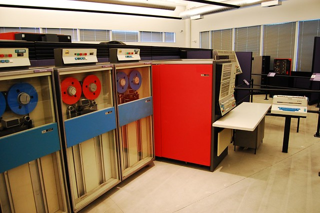

In the beginning of the electronic digital information systems, computers were used to perform computations. They were fed an input via a smart card, and an output would be printed out.

Later came peripherals that could be used to store data between computations. Scientists and engineers invented tape drives and hard drives, and suddenly you could use computers to, not only perform calculations but also to remember information.

> By Andrew Back, published [here](https://www.flickr.com/photos/carrierdetect/3598455187)

As time went on, the capacity of these storage devices grew, as grew the uses that people and companies started giving them. They now relied on these devices to store important information like bank accounts balances, transactions, contracts, and other important facts.

Initially, human operators were the only ones that could access these computers, a person whose job was to put and retrieve information from it. As more and more digital information started getting stored and retrieved, these operators started becoming a performance bottleneck.

To address this, some people invented time-sharing computers and remote terminals, where multiple operators could now access and manipulate the same data set. These terminals were dumb, and transmitted text and keyboard events using a local network connection.

Sometime later came the Graphical User Interfaces; GUIs started becoming the standard way of accessing a data set. No longer you were running a text-based remote terminal that was executing on the same machine that had the data. Instead, an application was running on another computer and was accessing a database server via a local network. This database software was now exposing a generic network interface that application developers could use to access it. Now there was a more apparent separation of the application and the database management system.

Sometimes this database system had to scale to accommodate not only multiple users on the same local network but also many more users on a wide area network. Since a single computer is serving this database, the hardware for these database management systems had to become more powerful (faster discs, more and faster RAM, fast CPUs).

Then came the internet and with it, having to serve many more customers at the same time using the same type of technology. In modern online transaction-processing systems that work at such a large scale, you typically have at least three layers of software. In the example of a web application, you have the client UI that talks HTTP to a server that implements the business logic. This server may then, in turn, use other services or one or more databases to persist data.

This database then becomes the single source of truth and also the bottleneck of performance and availability. If this server becomes overloaded or unavailable because of a bug, a network failure, or a hardware malfunction, this service can't operate, and with it, a company's service and source of revenue.

## Caching

To address this problem, the consistent practice of several techniques has emerged since the early 00's. One of them is caching. Because of the continuous fall in the price of hardware, caching data in memory reduced the strain in these databases, alleviating the database from a portion of the read requests. With this, these database servers now had more resources available to dedicate to writes.

But it's not all roses. You may say that caching introduces some complexity into a system that, before, was using one source of truth. Now, you have a distributed system replicating data, and much effort has to go into ensuring consistency across these systems.

Different applications may require different levels of consistency: a social network probably doesn't need to be as consistent as a banking application. But still, caching and cache invalidation are still hard problems to solve, specially when you're dealing with different failure modes.

## Divide and conquer

Another solution was to partition the data, spreading it throughout many servers. The data is now somehow divided into different slices, and each slice is attributed to a different server. This partitioning technique, also commonly known as "sharding," allows a service to partially survive network, hardware or software problem, by containing a given failure to only a subset of the data.

But this technique imposed a new problem to be solved. When operating on data on the same partition, it's relatively simple to keep the data consistent. But when a request happens where we have to perform changes in data that lives in different partitions, we now have a complex problem to solve.

What happens if, when serving a request that requires a change in two partitions A and B, partition A succeeds and B fails? You may have different solutions for this, depending on your consistency requirements.

You could schedule a reparation on partition B when it comes back alive by, for instance, inserting the operation on a local queue. By doing this, you risk that the data is inconsistent for some time. Again this may be fine for your application.

Alternatively, you can roll back the change in partition A if you had already committed it. Still, if you had already committed the change in partition A, there was a window where the data would have been inconsistent while you were trying to operate partition B. Worse, what happens if the rolling back in partition A fails? To solve these problems and guarantee consistency, we would need to enter the realm of distributed transactions, transaction monitors, and two-phase commit protocols.

Again, this is a lot of added complexity. Now, all of a sudden, you have to manage an ad hoc distributed system with many new corner cases, potential bugs, and failure modes.

## Synchronous replication for consistency

But what if we had multiple servers but had them replicate synchronously between each other? For instance, if we had two servers, a write to one server would only succeed if and only if that server managed to replicate it to the other server successfully.

Synchronous replication has the advantage that it keeps consistency and that we can now distribute the read operations. Still, now, this system is not resistant to malfunctions. In the face of a network, hardware, or software failure in one server, the other server is not able to perform writes because it's not able to replicate the operation synchronously. If consistency is paramount, that write operation has to fail.

## Loosen the consistency requirements

As we saw, if you want high availability in a distributed system, you can't have strict consistency. If, in your application, you can relax consistency, you have the chance to be more available in the face of failure.

Around this time (the '00s), a new set of database technologies started appearing that catered to this better-inconsistent-than-offline type of internet business.

In these new types of data management systems, you have different servers that the clients can use to perform write operations. Each of these servers replicates the operations to the other members of the cluster in the background, asynchronously. In this scenario, replication is a "best-effort" endeavor, where no guarantees are given for when it has occurred.

Relaxing the consistency requirements can allow these systems to be more available (machines can go down as long as there are other machines in the cluster working). Still, not knowing whether the data stays consistent between consecutive reads or between a write and a read may be challenging to the programmer or the user.

For instance, imagine that two different clients write different values to the same document to different servers at about the same time. Both servers are going to try to replicate different versions of the same document to others. Depending on the order, one of them may win on a given server, and the other may win on another. Ending up with different versions on different servers violates eventual consistency, as the values may never converge across different servers.

We can solve this by versioning each document. Instead of merely using a single version number, we need a way to track the changes that happen in this distributed system. Version vectors are a common way to solve this. In this version representation, each server has an independent counter in this vector that it increments when the data changes locally. When replicating that document to other servers, this version vector travels with it. This way, servers can now compare two versions of the same document and, looking at the version vector, infer causality. They can now know whether a version of the document happened before, after, or is concurrent to another version.

When deciding what to do with two versions and determining that one depends on the other, we can safely discard the older one. But what if the changes happened independently of each other?

## Managing conflicts

One possibility is to do nothing. Store both these conflicting versions, and serve them both if a client asks for that piece of data, turning this problem into an application or user problem. Now the client can have more than one version of the same document, and it can choose to either a) show the conflict to the user or b) solve the conflict, writing a new version.

Another possibility is to avoid conflicts altogether. By using types of data that are conflict-free, merging conflicts can be done automatically by each of the participants. Using these types of data called "Conflict-free Replicated Data Types," we can guarantee that the servers converge to the same value. And that they can do so independently of the perceived order of operations.

But still, the client can read stale data. If, for instance, the client writes to a server and that server goes down immediately after, the client now can only read a stale piece of data from any of the other servers. What can we do about this?

## Mitigating the chance of stale reads

Instead of writing the document to one server, let's say that the client tries to talk to all the servers responsible for that document at the same time. But instead of waiting for all of them to respond, the client only waits for _a majority_ of them. Since some of the participants can be down at any given time, this guarantees that you only need a majority to be available. After this, when serving another request, if the client wants to read back the value, it can query all the servers. As long as it gets a response from the majority of the servers, the client is confident that it has obtained the latest version.

Since the data is versioned, it can distinguish from different versions being returned from different servers, discarding the outdated ones, and merging concurrent ones.

## Local-first

The devices that our users use are increasingly more and more powerful. Most of us carry in their pockets what would look like a supercomputer only a few years ago. Having this amount of power spread throughout the world allows us to shift more and more computational logic from the server to the client. Doing so not only alleviates the application servers but also makes our applications feel faster. But what about data?

Network latency is a fact of this universe. Having an application that has to contact a server and wait for its response for every operation is a cost that is often visible to the users, making the application feel sluggish. If we have started burdening the clients with more and more computations, why not do the same with data operations?

In fact, for some applications, we can use the same principles of eventually consistent data and do just that. Instead of having to rely on a server for every data query or operation, we can instead perform everything locally, and in the background sync these changes to the server. The application type permitting, we can perform the changes locally and let the user carry on, making the application feel snappier and more responsive.

By treating the device as one more node in a decentralized database, we can apply some of the principles we have discussed here. By doing so, we can not only make applications more responsive, but we can also allow them to be more tolerant of failure. These applications can now work offline or when the back-end service is unavailable for some reason.
